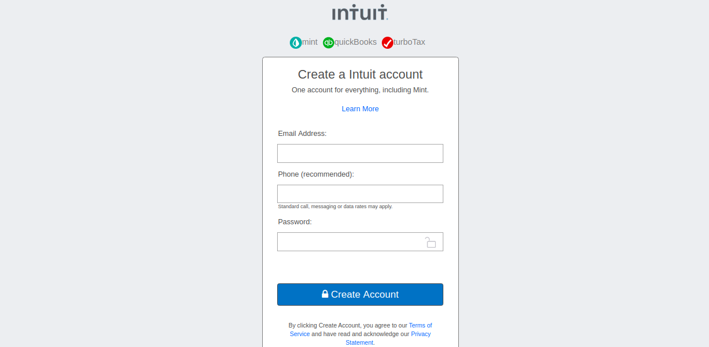

# Project: HTML Forms - Mint
  
This collaborative project is based on the intuit.com form, as a part of the assignment for microverse using concepts of HTML5 and CSS3, to create the sign up form.

## Built With

- HTML5
- CSS3

## Authors

👤 **Gonza Javier Mancilla**

- Github: [@github/gonjavi](https://github.com/gonjavi)
- Linkedin: [linkedin](https://www.linkedin.com/in/g-javier-mancilla-a686a9178/)

👤 **Antonio Fernandes**

- Github: [@github/trox115](https://github.com/trox115)

## Live Demo

[Live Demo Link](https://trox115.github.io/mint)

## 🤝 Contributing

Contributions, issues and feature requests are welcome!

## Show your support

Give a ⭐️ if you like this project!

## 📝 License

This project is [MIT](lic.url) licensed.

